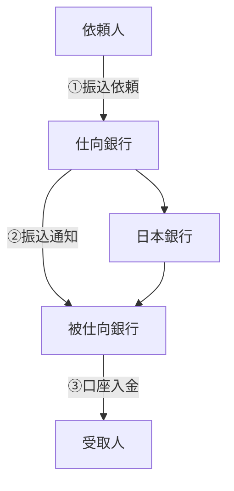
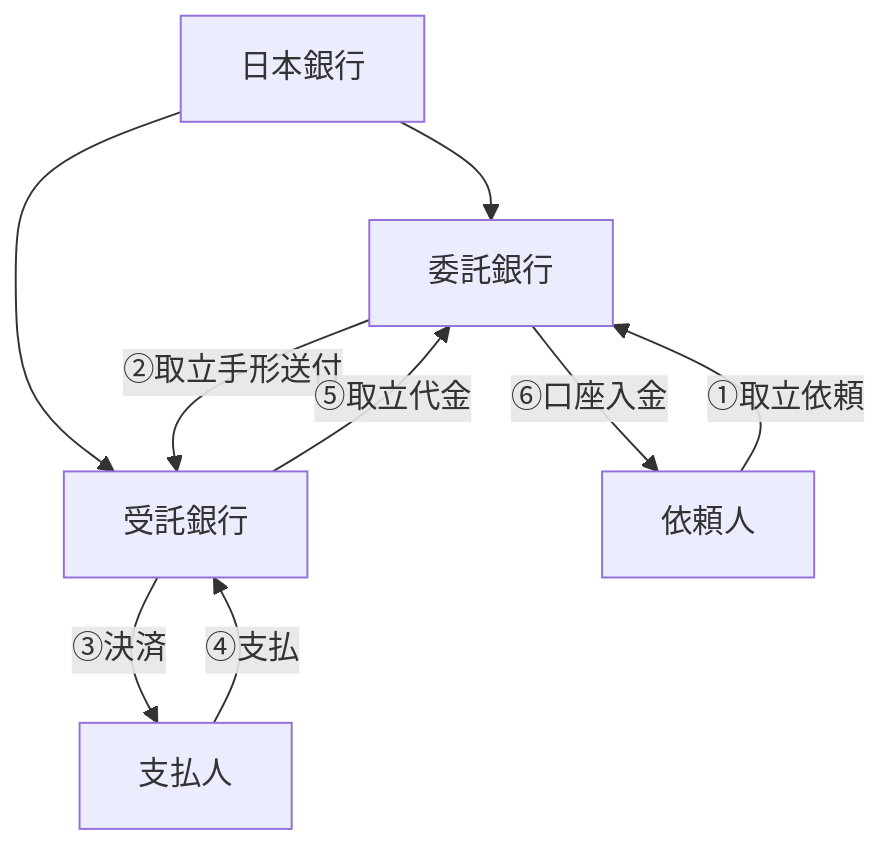

# 第1回：銀行の三大業務と、それを担う人たち

## 主なテーマ

銀行の基本となる三大業務を軸として、

* 何をしているのか
* 誰がやっているのか

を整理する。

## 三大業務
銀行が行うことができる業務は、銀行法によって定められている。
近年は金融の自由化により銀行で取り扱う業務は多岐にわたるが、以下の固有業務は銀行の3台業務と呼ばれている。

1. 預金
    - お客様からお金を預け入れる業務。資金の調達手段。
2. 貸出
    - お客様に資金を貸し付ける業務。資金の運用手段。
3. 為替
    - 資金の移動・決済を行う業務。国内の取引を取り扱う内国為替（通称内為）と、海外との取引を取り扱う外国為替（通称外為）に大別される。

> Point: 銀行は預金で調達した資金を原資として、貸出で運用することで収益を得ている。

## 預金
預入期間に定めのない預金を流動性預金、定めがある預金を定期性預金という。

### 流動性預金
要求払い預け預金ともいわれ、お客様から払戻の要請があればいつでも直ちに応じる必要がある。当座預金・普通預金・貯蓄預金・納税準備預金など。

### 定期性預金
あらかじめ預入期間を定め、その期間中は銀行が払戻に応じる法的義務を負わない預金。一般的に流動性預金よりも高い利率が適用される。

> Point: 預金は貸出の原資であるため、いつ払い出されるかわからない流動性預金よりも、預入期間に定めのある定期性預金でより安定した資金を確保しておくことが望ましい。

### 担当する人・部署：
- 
- 
- 
- 
- 
- 
- 

> point: 「金利ある世界」で収益力を回復した融資を伸ばすため、実質的な原資となる預金集めは銀行経営の最優先課題になりつつある。(https://www.nikkei.com/article/DGXZQOUB271AA0X20C26A7000000/)

---

## 貸出（融資）
総資産に占める貸し出しの割合は約33.2％（2025年3月期）で、現在もその重要性は高い。

- 商業手形割引
- でんさい割引
- **証書貸付**
    - 取引先から借用証書として金銭消費貸借契約証書の差入を受けて行う貸出。主に分割返済の約定がある貸出に利用される。
    - 例：工場建設・機械購入などの設備士資金借入、住宅ローンなど個人向けローン
- **一般当座貸越**
    - 手形や小切手を振り出す当座預金口座に一定の貸越制度を設ける取引
- **特別当座貸越**
    - 貸出用の当座預金口座は解説しないで、銀行が取引先との約定によってあらかじめ定めた一定の限度額（貸越極度額）まで継続反復して資金を貸出す取引
- 支払承諾
- 代理貸付 

### 担当する人・部署：
- 
- 
- 
- 
- 
- 
- 

---

## 為替

隔地間の資金の移動を現金の輸送によらず円滑に行うことができるように、銀行が仲介する業務。
投稿で扱う主な為替取引は振込と代金取立。

<振込の仕組み図>

<代金取立の仕組み図>

為替取引の発生個所によって分類すると、仕向為替と被仕向為替に大別できる。
- 依頼人からの依頼を受け、為替取引を仕向ける側の業務。
- 為替取引を受ける側の業務。

| --- | 国内業務 | 外為業務 |
| --- | --- | ---: |
| 為替 | 仕向送金 | 仕向外国送金 |
|  | 被仕向送金 | 被仕向外国送金 |
|  | 取立 | 取立 |

### 担当する人・部署：
- 
- 
- 
- 
- 
- 
- 

---

### 第1回で伝えたいこと

三大業務を軸に、

> **同じ銀行業務でも、顧客と接する人、本店で商品や制度を考える人、審査する人、事務をする人、銀行全体を管理する人がいる**

ことを理解してもらう。

銀行の組織図をそのまま覚えてもらうのではなく、

> **業務 → 人 → 部署**

という順番で銀行内部の構造を理解してもらう。

---

## 研究所との接点

三大業務だけでも、研究テーマとなり得る問題が存在する。

### 預金

* 誰が預金を増やしてくれそうか
* 預金金利を変えると残高はどう変化するか
* どの施策がメイン口座化につながるか

→ 顧客行動予測
→ 時系列予測
→ 因果推論
→ マーケティング分析

### 貸出

* 誰に貸してよいか
* 将来返済できなくなる可能性はどの程度か

→ 信用リスクモデル
→ 機械学習

### 為替・決済

* 通常と異なる怪しい送金はないか

→ 異常検知
→ 不正検知

---
